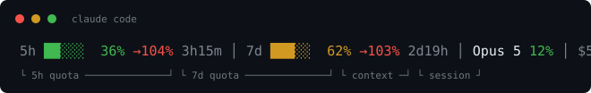

# ccbar

A one-file status line for Claude Code. No daemon, no cache, no network, no dependencies.



```
5h ██░░░  36% →104% 3h15m │ 7d ███░░  62% →103% 2d19h │ Opus 5 12% │ $5.23
```

## Why

Claude Code already pipes everything a status line needs to its `statusLine`
command on stdin — quota usage and reset times, context window, cost, model,
cache state. Reading that blob and printing one line is the whole job.

So ccbar is ~150 lines of stdlib Python in a single file. It spawns per tick,
prints, and exits. Nothing stays resident.

| | ccbar | a daemon-backed bar |
|---|---|---|
| resident processes | 0 | 3+ |
| install size | 5 KB | ~28 MB |
| per tick | ~22 ms | ~86 ms |
| dependencies | none | Python runtime bundle |

## Reading the bar

The line mixes three things that reset on different clocks. Worth knowing which
is which before you react to a red number.

| segment | resets when |
|---|---|
| `5h` `7d` quota | the window rolls over, on its own schedule |
| `Opus 5 12%` context | you start a new conversation |
| `$5.23` cost | you start a new conversation |

### `5h ██░░░  36%` — plan quota

Share of the rolling 5-hour and 7-day limits already spent, from
`rate_limits.five_hour` and `rate_limits.seven_day`. The bar is the same number
as the digits, there to be readable at a glance without reading. Green below
60%, yellow to 85%, red above.

On a third-party relay or Bedrock/Vertex there is no quota, so Claude Code
sends no `rate_limits` and both segments disappear rather than showing zeros.

### `→104%` — projection

Where usage lands at window close if the current burn rate holds. Over 100%
means you run out before the window resets.

Claude Code sends when a window *resets* but not when it opened, so the start
is `resets_at - window` and the rest is `used ÷ elapsed_fraction`. Two calls in
the first minute of a window look like an infinite rate, so the projection
stays hidden until 10% of the window has passed.

It extrapolates the whole window's average forward in a straight line. A heavy
burst in the last twenty minutes will overstate it — treat it as a direction,
not a forecast.

### `3h15m` — time to reset

Counts down to `resets_at`. Reads `2d19h` past a day, `14m` under an hour.

### `Opus 5 12%` — model and context window

The percentage is how much of the **context window** this conversation has
filled (`context_window.used_percentage`), not quota and not anything about the
model. At 12% of a 1,000,000-token window, roughly 122k tokens of history are
live. It only climbs as a conversation grows; near the top Claude Code compacts
the earlier turns. A new conversation starts over at zero.

### `$5.23` — session cost

`cost.total_cost_usd` — what **this conversation** has cost so far. Not a daily
or monthly total, and it resets with each new session. Dimmed because it is the
least actionable number on the line.

## Install

Drop the file somewhere and point Claude Code at it:

```bash
curl -fsSL https://raw.githubusercontent.com/egg-/ccbar/main/ccbar.py -o ~/.local/bin/ccbar
chmod +x ~/.local/bin/ccbar
```

Then in `~/.claude/settings.json`:

```json
{
  "statusLine": {
    "type": "command",
    "command": "/Users/you/.local/bin/ccbar",
    "refreshInterval": 10
  }
}
```

Restart Claude Code once. That's the install — there is nothing to uninstall
but the file and those four lines.

`refreshInterval` is in seconds. At 10s a 22 ms tick costs about 0.2% of one
core; at 1s it costs 2%. Quota percentages do not move fast enough to be worth
the difference.

Because each tick is a fresh process, edits to the script take effect on the
next tick. No restart, no reload.

## Configure

Edit the constants at the top of the file:

```python
WARN, CRIT = 60, 85   # percentages where green turns yellow, then red
BAR_WIDTH = 5
```

There is no config file, and that is deliberate. Editing two numbers in a
script you already own is less machinery than a config format, a parser, and a
`config set` subcommand.

## Adding a segment

The stdin blob carries more than the bar shows — `prompt_cache` (hit ratio,
TTL, expiry), `effort.level`, `session_name`, `thinking.enabled`, `fast_mode`,
lines added and removed. Read the field and append to `seg` in `render()`:

```python
eff = (d.get("effort") or {}).get("level")
if eff:
    seg.append(f"{DIM}{eff}{RESET}")
```

To see the whole blob for your own session, have the status line dump it once:

```json
"command": "tee /tmp/blob.json | /Users/you/.local/bin/ccbar"
```

## Test

```bash
python3 ccbar.py --selftest
```

Render against a payload:

```bash
echo '{"model":{"display_name":"Opus 5"},"cost":{"total_cost_usd":1.5}}' | python3 ccbar.py
```

Every segment is dropped when its data is absent, so a partial blob renders a
shorter line instead of erroring, and malformed JSON prints nothing at all.

## Prior art

[leeguooooo/claude-code-usage-bar](https://github.com/leeguooooo/claude-code-usage-bar)
(MIT) is the fuller take on this idea — themes, styles, a desktop HUD, a daemon
render path. Reach for it if you want those. ccbar shares no code with it and
exists because the stdin contract makes the minimal version this small.

## License

MIT
